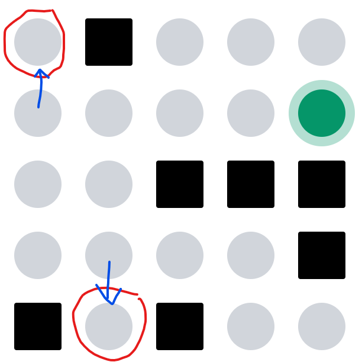

# Dot Connect
Dot connect adalah permainan yang menantang para pemain untuk dapat menghubungkan semua titik yang ada pada board permainan. Selain itu, pada board game sudah ditentukan titik awal permainan dengan beberapa titik blok yang tidak dapat dilewati. Pemain ditantang dengan beragam board dengan beberapa tingkat kesulitan.

### Author: Suthasoma Mahardhika Munthe 13522098

### Tech Stack
- Frontend:
  - Next.js
  - React
  - TypeScript
  - Tailwind CSS
  - ShadCN UI

- Backend:
  - Golang
  - Node.js

- Database:
  - PostgreSQL
  - Prisma

- Authentication:
  - NextAuth.js

- Development Tools:
  - ESLint
  - Prettier

### Board Solver Algorithm
Algoritma yang digunakan untuk menyelesaikan permainan ini adalah algoritma ```Branch and Bound```
Algoritma Branch and Bound adalah algoritma yang mengikuti cara kerja algoritma BFS. Namun, algoritma BnB ini memiliki fungsi tambahan (```bound function```) yang berfungsi sebagai fungsi yang digunakan untuk memangkas simpul yang tidak dapat mencapai tujuan.
Bound function yang digunakan pada kasus permainan Dot Connect adalah fungsi yang menghitung titik atau node pada board yang hanya memiliki satu akses atau bahkan tidak memiliki akses untuk terkoneksi dengan sambungan titik-titik penyelesaian. Node atau titik yang hanya memiliki satu akses pada board maksimal berjumlah 1, sementara node atau titik yang tidak memiliki akses sama sekali tidak boleh muncul pada board. Jika syarat ini tidak dipenuhi maka dapat disimpulkan bahwa langkah saat ini tidak dapat mencapai solusi sehingga cabang yang tidak sesuai dapat dipangkas.
<div align=center>

<br>
  <b>Fig 1.</b> Board yang tidak memiliki solusi
<br>
</div>
Pada board di atas, terdapat 2 node yang hanya memiliki satu akses. Artinya saat mencapai salah satu node, maka tidak memungkinkan untuk mencapai node yang lain. 

Kompleksitas dari algoritma yang digunakan dipengaruhi oleh dua variabel, yaitu ```h``` dan ```w```. Variabel ```h``` adalah ukuran vertikal (tinggi) dan ```w``` adalah ukutan horizontal (lebar) board.
Saat mencapai satu titik, mulai dari titik itu maksimal ada 3 titik yang dapat dipilih. Sehingga kompleksitas dari algoritma ini adalah 
$$
T(h,w) = 3^{(h \cdot w - 1)}
$$
sebagai batas atas.
Sehingga didapatkan jika komplesitas Big O dari algoritma ini adalah 
$$
O(n) = 3^{n}
$$
dengan $n = h \cdot w$

### How to Run
> Pastikan Anda sudah menginstall Node.JS, npm dan go.

Setelah Anda mendownload project ini lakukan instalasi node modules
```
npm install
```
Selanjutnya, jalankan Front-End pada mode development dengan command ini
```
npm run dev
```
Jangan lupa untuk menjalankan Back-End. Kode backend ada pada folder ```backend```. Oleh karena itu, pindah dahulu ke folder tersebut dengan command ```cd backend``` kemudian jalankan command ini
```
go run main.go
```
Jika ada pop up firewall, pilih allow untuk menjalankan server.

### Implemented Bonus
- Bonus waktu eksekusi. 🤌🙏
- Animasi bot. 

### Referensi
- Algoritma Branch and Bound dipelajari dari [modul ini](https://informatika.stei.itb.ac.id/~rinaldi.munir/Stmik/2020-2021/Algoritma-Branch-and-Bound-2021-Bagian1.pdf). 
